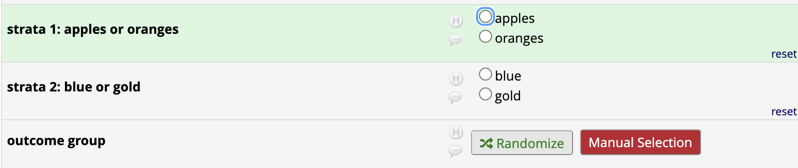
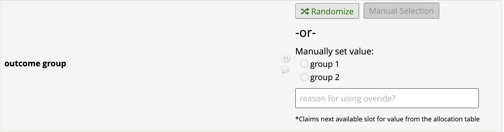
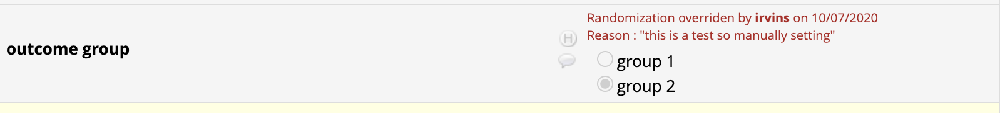
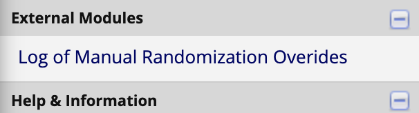
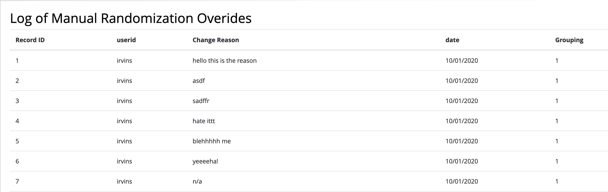

# Randomizer Override

## What it Does
The external module permits only SELECTED USERS to manually SET the value normally set by the built-in REDCap allocation-based randomization.  This can be especially useful if a manual/envelope-based method was used to randomize a participant while REDCap was offline or unavailable.

When a selected user manually sets the random output for a record, an allocation entry is consumed if available.  This means that so long as you randomize additional records in the future, your project should re-stabilize to the allocation ratio defined in your allocation table.

## How it Works
The EM injects appropriate UI into the "add/edit" workflow of the randomization instrument to allow the user to manually select the desired value, and subsequently "claim" the allocated value in the allocation table.

If all allocated values are already claimed the UI inputs will remain "disabled"

#### Only authorized users will have this privilege

Be sure to set usernames with override permissions in the EM config settings.

#### Manual Selection button will appear for un-randomized records

Fields chosen to be Randomized fields will have the default "Randomize" button with a new red button labeled "Manual Selection" next to them.

#### Upon selection, you can set the new outcome group

When the Manual Selection button is clicked and strata values are already defined, the user will be able to select the desired random outcome group.

Once a value is set (along with reason for manual selection) the selections will be disabled with the reason displayed in red.

#### A log of manual randomization overrides with reasons

A log of Randomizations overridden can be viewed with this EM link
